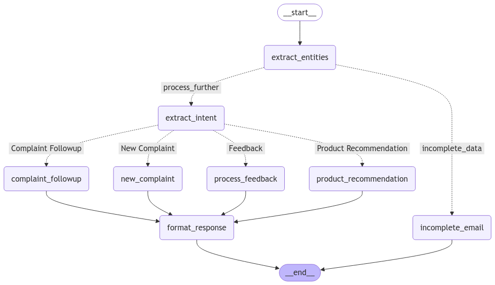

# Sephora Customer Service LangGraph Agent



## Overview

This project implements an advanced AI-powered customer service agent using LangGraph for Sephora, designed to intelligently process and respond to customer communications including feedback, complaints, and product inquiries.

## Features

- **Intelligent Email Processing**: Automatically categorizes and handles different types of customer communications
- **Multi-Stage Agent Workflow**: Utilizes LangGraph to create a sophisticated state-based agent
- **Flexible Communication Handling**:
  - Feedback processing
  - Complaint management
  - Incomplete information handling
  - (Potential) Product recommendations

## Technology Stack

- Python
- LangGraph
- LangChain
- Pydantic
- Groq API
- LangSmith (for tracing)

## Prerequisites

- Python 3.8+
- API Keys:
  - LangChain
  - Groq

## Installation

1. Clone the repository
```bash
git clone https://github.com/mazumdarabhishek/Customer-Email-Reponse-Agent.git
cd sephora-langgraph-agent
```

2. Create a virtual environment
```bash
python -m venv venv
source venv/bin/activate  # On Windows, use `venv\Scripts\activate`
```

3. Install dependencies
```bash
pip install -r requirements.txt
```

4. Set up environment variables
- Create a `.env` file
- Add your API keys:
```
GEMINI_API_KEY=your_api_key
GROQ_API_KEY=your_api_key
GEMINI_FLASH=gemini-1.5-flash
OLLAMA_EMBED=nomic-embed-text:latest
LLAMA_70B_GROQ=llama-3.3-70b-versatile
COMPLAINT_TABLE=customer_complaints
ORDER_TABLE=orders
FEEDBACK_TABLE=feedbacks
DB_NAME=online_store
```

## Usage

```python
python CustomerCareAgent.py
```

## Agent Workflow

1. **Extract Entities**: Parse incoming email
2. **Determine Intent**: Classify email type
3. **Process Communication**:
   - Feedback handling
   - Complaint management
   - Incomplete information requests
4. **Format Response**: Generate appropriate customer response

## Configuration

Modify `helper_agents.py` and `pydantic_classes.py` to customize agent behavior and state management.

## Tracing and Monitoring

Integrated with LangSmith for comprehensive workflow tracing and debugging.


## Contact

Your Name - mazumdarabhishek94@gmail.com

Project Link: [https://github.com/mazumdarabhishek/Customer-Email-Reponse-Agent.git](https://github.com/mazumdarabhishek/Customer-Email-Reponse-Agent.git)
